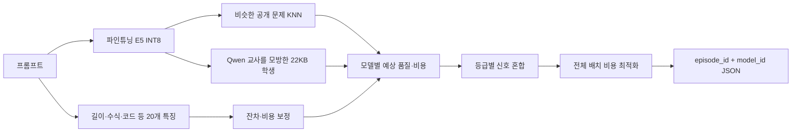

<!--
SPDX-FileCopyrightText: Copyright 2026 Diwoni contributors
SPDX-License-Identifier: Apache-2.0
-->

# 예산 강건형 의미 기반 LLM 라우터

**파인튜닝 E5 + Qwen 교사-학생 증류 + 배치 비용 최적화로, 프롬프트마다
`ax31-light`, `ax31`, `axk1-think` 중 가장 효율적인 모델을 고르는 SKT 지정과제
출품작입니다.**

> 이 라우터는 LLM 답변을 생성하지 않습니다. 질문 내용만 읽고 평가용 모델 하나를
> 선택합니다. 공개 Dev 재대입 숫자 하나를 최대화하기보다, 보지 못한 문제에서도
> 비용 초과로 등급 전체가 0점이 되지 않도록 일반화·안전성·실행 재현성을 함께
> 최적화했습니다.

## 심사자를 위한 60초 요약

| 항목 | 최종 근거 |
| --- | --- |
| 최종 구조 | 파인튜닝 E5 의미 표현 + 20개 내용 특징 + KNN + 잔차 head + Qwen 학생 + 비용 배분기 |
| Qwen 사용 방식 | 공개 프롬프트의 오프라인 교사로만 사용, 최종 이미지는 22,894바이트 학생 계수만 포함 |
| 공개 Dev 재대입 | **0.716420454545**, 세 등급 모두 공개 비용 통과. 숨은 점수 추정치가 아닌 패키징 회귀 검사 |
| 일반화 신호 | 고정 Qwen 학생 후보가 공식·층화·내용군 7개 교차검증에서 **7/7 양수** |
| 비용 강건성 | 문제군 비율·모델 비용·4회 생성 비용을 흔든 **228/228 시나리오 통과** |
| 실행 안정성 | 공식형 ARM64 제한에서 등급별 2회 통과, 최악 64.061초/90초 |
| 결정성 | 정상·역순 2,640문항 비교에서 누락 0, 추가 0, 선택 불일치 0 |
| 공급망 | 고정 리비전·SHA-256, GitHub Release, SPDX 2.3 SBOM, 제3자 NOTICE |

최종 컨테이너 digest는 다음과 같습니다. 제출에는 변경 가능한 태그가 아니라 이
전체 참조를 사용합니다.

```text
ghcr.io/diwoni/ossp-2026-llm-router-challenge@sha256:1913d548e33fe9fcad60eac4e33c73142c73e0b3b1754061080c941154b63829
```

## 과제 개요

운영자는 각 질문에 세 모델이 과거에 얼마나 잘 답했고 토큰을 얼마나 썼는지 공개
Train·Dev 자료로 제공합니다. 우리는 그 자료를 이용해 새 질문이 들어왔을 때
다음을 예측합니다.

1. 각 모델을 고르면 예상 품질이 얼마나 되는가?
2. 각 모델을 고르면 예상 비용이 얼마나 되는가?
3. 전체 질문 묶음의 비용 제한 안에서 어디에 비싼 모델을 써야 가장 이득인가?

`score`는 같은 모델을 2회 또는 4회 생성해 맞힌 비율이므로 0, 0.5, 1 또는
0, 0.25, 0.5, 0.75, 1처럼 보입니다. 라우터 실행 중에는 이 정답률이나 토큰
결과가 주어지지 않습니다. 오직 프롬프트 내용과 평가 등급만 사용합니다.

| 등급 | 비용 한도 | 최종 점수 가중치 | 최종 안전계수 |
| --- | ---: | ---: | ---: |
| Fast | 1.25 | 0.4 | 0.95 |
| Balanced | 2.0 | 0.3 | 0.90 |
| Premium | 4.0 | 0.3 | 0.78 |

비용 한도를 넘으면 해당 등급 점수가 0점입니다. 그래서 예산 끝까지 비싼 모델을
채우는 것보다, 숨은 분포와 토큰 비용 오차에도 살아남는 여유가 중요합니다.

## 최종 라우팅 흐름



### 1. 파인튜닝 E5

`intfloat/multilingual-e5-small`의 마지막 인코더 블록과 160차원 투영 head를 공개
Train으로 학습했습니다. 단순한 쉬움/어려움 분류가 아니라 세 모델의 품질, 로그
비용, 모델 간 품질 차이와 순서를 동시에 학습합니다. 긴 문제의 마지막 질문이나
코드 `assert`를 잃지 않도록 토큰의 44%는 앞, 56%는 뒤에서 취합니다.

### 2. KNN과 작은 보정기

새 질문과 의미가 가까운 공개 질문을 찾아 실제 모델별 성적을 가중 평균합니다.
E5가 놓치는 길이·코드·수식 신호는 20개 내용 특징과 작은 잔차 head가 보정합니다.
최종 실행에서는 scikit-learn 객체 대신 내보낸 트리와 계수만 NumPy로 계산합니다.

### 3. Qwen 교사-학생 증류

`Qwen3-Embedding-0.6B`은 학습 시 공개 프롬프트를 표현하는 오프라인 교사로만
사용했습니다. Qwen 표현을 E5 160차원과 내용 특징 20개만 보는 Ridge 학생에게
옮겼습니다. 평가 컨테이너에는 Qwen 가중치, 외부 API, GPU가 없습니다.

### 4. 비용을 아는 전역 배분

문항별 점수만 보고 독립적으로 모델을 고르지 않습니다. 전체 입력 배치에서 예상
품질 이득과 예상 비용을 함께 보고, 등급별 안전 예산 안에서 이득이 큰 질문부터
비싼 모델에 배정합니다. Fast에서는 `axk1-think`를 후보에서 완전히 제거합니다.

자세한 학습 인자와 수식은 [최종 라우터 설계](docs/FINAL_ROUTER_KO.md), 후보를
채택하거나 버린 근거는 [후보 실험 보고서](docs/CANDIDATE_EXPERIMENTS_KO.md)에
있습니다.

## 점수를 읽는 올바른 방법

| 수치 | 의미 | 사용 목적 |
| ---: | --- | --- |
| 0.695369318182 | 공식 hash-regex 공개 Dev | 공식 기준선 |
| 0.706846590909 | Train-only E5를 공개 Dev에서 평가 | 개발 기준선 |
| 0.717613636364 | Premium 안전계수 0.84 공개 Dev 재대입 | 스트레스 실패로 기각 |
| **0.716420454545** | Premium 0.78 최종 공개 Dev 재대입 | 최종 패키징 회귀 검사 |
| 0.711714015152 | 공개 Train+Dev 강건성 기준 시나리오 | 숨은 점수 예측 아님 |

공개 전체로 만든 자산을 같은 Dev에 재대입한 0.71642는 실제 심사 점수의 예측값이
아닙니다. 최종 후보를 고른 핵심 근거는 Qwen 학생의 7/7 방향 일치, 228개 비용
스트레스 0회 실패, 입력 순서 독립성과 공식 컨테이너 실행 통과입니다.

## 채택과 기각

| 방법 | 판단 | 이유 |
| --- | --- | --- |
| 파인튜닝 E5 + 의미 KNN | 채택 | Train-only Dev 기준선을 올리고 ARM64 제한에서 실행 가능 |
| Qwen 교사 → E5 학생 | 채택 | 7개 교차검증이 모두 양수, 런타임 추가 자산 22KB |
| 생성 횟수 인지 GLM | 기각 | OOF는 올랐지만 고정 후 Dev가 하락 |
| 비선형 GBM | 기각 | Premium Dev가 0.01108 하락 |
| 문제군별 전문가 | 기각 | Dev 하락과 비용 4.099 초과 |
| 문제군별 강제 예산 | 기각 | 안전성 일부 개선보다 Premium 품질 손실이 큼 |
| Premium 안전 0.84 | 기각 | 228개 스트레스 중 4개 예산 실패 |
| Premium 안전 0.78 | 채택 | 228개 모두 통과, 최악 비용비 3.973534 |

## 빠른 재현

### 1. 자산 내려받기와 이중 해시 검증

```console
scripts/download_method4_assets.sh
```

Release 압축 SHA-256을 먼저 확인하고, 압축을 푼 뒤 10개 파일의 크기와 SHA-256을
다시 확인합니다. 전체 자산은 636,519,519바이트입니다.

### 2. 로컬 라우터 실행

```console
METHOD4_FINAL_ASSETS=build/final-assets/method4 \
  scripts/run_final_router.sh \
  data/materialized/dev/inputs.json balanced build/submission/balanced.json
```

### 3. ARM64 이미지 빌드

```console
scripts/prepare_method4_container_assets.sh

docker build --provenance=false --platform linux/arm64 \
  --file container/method4.Dockerfile \
  --build-arg SOURCE_COMMIT="$(git rev-parse HEAD)" \
  --tag ossp-method4:local .
```

### 4. 공식형 제한 검사

```console
PYTHONPATH=src:. python3 tools/check_runtime.py \
  --image ossp-method4:local \
  --repetitions 2 \
  --report build/method4-runtime-check.json
```

## 저장소 안내

| 경로 | 역할 |
| --- | --- |
| `experiments/method4_finetuned_encoder/` | E5 학습·ONNX 추론·KNN·잔차·증류·최종 라우팅 |
| `experiments/validation/` | 내용군·문제군 분할과 비용 스트레스 |
| `configs/method4-tier-gate.qwen-student.json` | 세 등급의 최종 정책과 안전계수 |
| `container/method4.Dockerfile` | 최소 ARM64 CPU 제출 이미지 |
| `artifacts/` | 모델 파일 manifest, Release와 이미지 digest 메타데이터 |
| `reports/` | 채택·기각·비용·실행·SBOM 원본 JSON |
| `scripts/` | 학습·평가·자산 검증·실행 자동화 |
| `tests/` | 프로토콜·점수·누수·결정성·비용·런타임 테스트 |
| `docs/` | 공식 규칙과 한글 설계·실험·제출 문서 |

## 검증 증거

- [최종 실험 종합](docs/FINAL_EXPERIMENT_REPORT_KO.md)
- [최종 라우터와 파인튜닝](docs/FINAL_ROUTER_KO.md)
- [비용 강건성 228개](docs/COST_ROBUSTNESS_KO.md)
- [ARM64 컨테이너 검증](docs/CONTAINER_VERIFICATION_KO.md)
- [대안 모델 비교와 채택 근거](docs/CANDIDATE_EXPERIMENTS_KO.md)
- [기준선 재현](docs/BASELINE_REPRODUCTION_KO.md)
- [서면평가 30점 근거표](docs/JUDGING_EVIDENCE_KO.md)

전체 단위 테스트는 다음 명령으로 실행하며 현재 280개 통과, Docker가 필요한
11개는 별도 실제 격리 검사 보고서로 검증했습니다.

```console
PYTHONPATH=src .venv/bin/python -m unittest discover -s tests -p 'test_*.py'
```

## 오픈소스와 라이선스

프로젝트가 직접 작성한 코드와 문서는 Apache-2.0입니다. 포함한 E5는 MIT,
오프라인 교사 Qwen은 Apache-2.0이며, 원본 리비전·파일 SHA·변환 산출물은
[제3자 고지](THIRD_PARTY_NOTICES.md), [자산 manifest](artifacts/method4-assets.manifest.v1.json),
[SPDX SBOM](reports/method4-sbom.spdx.json)에 기록했습니다.

개발 과정은 한국어 이슈, 논리 단위 커밋, 실험 PR로 남겼습니다. 실패한 후보도
수치와 기각 이유를 보존하여 이후 기여자가 같은 실험을 재현하거나 다른 데이터와
인코더로 확장할 수 있습니다.

## 공식 과제 문서

- [과제 규칙](docs/CHALLENGE_RULES.md)
- [점수 계산](docs/SCORING.md)
- [컨테이너 규격](docs/RUNTIME.md)
- [기술 제출 안내](docs/SUBMISSION.md)
- [데이터 카드](docs/DATA_CARD.md)

출품작 제출 마감은 **2026년 8월 27일 18:00 KST**입니다. 최종 제출 시점부터
심사가 끝날 때까지 저장소와 이미지 digest를 별도 권한 없이 열 수 있어야 합니다.
